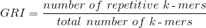
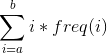

**GRIn is a small script to compute the Genome Repeat Index (GRI) from raw sequencing reads**

## Installation

GRIn requires Numpy and Scipy, so these need to be installed first. It has been
tested with Numpy 1.9.2 and Scipy 0.16.0. 

Once these packages have been installed, simply `git clone` the latest release
to a convenient location. GRIn can now be run with either `python grin.py` or
you can run `chmod +x grin.py` and then execute it as `./grin.py`

## The Genome Repeat Index

The Genome Repeat Index (GRI) is the percentage of all k-mer words which are predicted to be
repetitive. We predict that genomes with a lower GRI will be easier to assemble
than those with a higher one. Hence:

The number of k-mers in a set of reads occurring a minimum of `a` times and a
maximum of `b` times can be computed by:

where `freq(i)` gives the number of distinct k-mers occurring `i` times in the
set of reads.

## Using GRIn

First, it is important to note that GRIn requires extra
cutoffs to be set in order to work properly on real data. There are three possible
cutoffs: the Error Cutoff; the Repeat Cutoff; and the Upper Cutoff. In fact,
these cutoffs are so important that if they are not set by the user then GRIn
will estimate them itself and use those estimations in its calculation of the
GRI. 

##### The Error Cutoff

The Error Cutoff is used to exclude erroneous k-mers from being used in the
calculation. These are the k-mers contained in the initial error peak of the
spectrum (i.e. those only occurring fewer than, say, 10 times across all
reads). These k-mers are, with high probability, due to sequencing errors, as
they occur too few times to have originated from a genuine genomic region given
the sequencing depth. By default, this cutoff is set to be the `x` value of the
minimum between the error curve and the main peak.

##### The Repeat Cutoff

The Repeat Cutoff is our estimation of the minimum number of times we must
observe a k-mer in the set of reads for us to consider it repetitive. In a
k-mer spectrum with easily observed peaks, this is simply the minimum between
the first and second peak. If the peaks are not so easily observed, we set this
to be the value `R`, such that the k-mer depth is equidistant between the error
cutoff and `R`.

##### The Upper Cutoff

We use the upper cutoff to exclude k-mers which are probably due to PCR
duplication or other sequencing biases. If unset, GRIn sets this to 20 * k-mer
depth. 

## Notes

We recommend using a k-mer size of 31bp for this tool to work well, although
providing that the k-mers are 'long enough', we see little difference in the
resulting GRI when using various k-mer sizes.

We are currently writing a paper on the GRI and its uses. In it, all of the
things mentioned in this README will be looked into in more detail.

For anything to do with GRIn, contact George Hall at gh10@sanger.ac.uk
