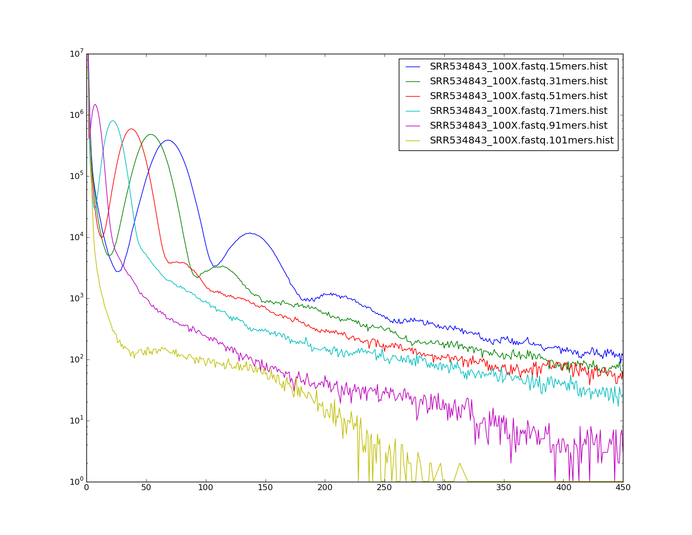

#### Small script to compute the Genome Repeat Index (GRI) from raw sequencing reads.

The GRI is the percentage of all k-mer words which are predicted to be
repetitive. We predict that genomes with a lower GRI will be easier to assemble
than those with a higher one.

It can be simply computed by: number of repetitive k-mers / total number of k-mers,
where the total number of k-mers can be computed as the sum of the number of occurrences
multiplied by the frequency of k-mers occurring this number of times, for all occurrences
in the k-mer spectrum [= (x * y) for all (x , y) in the data file)]

The k-mers counted for this statistic need to be reasonably large (>= 31bp) for this
metric to be meaningful, as we have found that shorter k-mer words can lead to
inaccuracies in the k-mer spectra produced.

Graph showing the effect of different k-mer sizes on the spectrum:

Requires Numpy and Scipy. Tested with Numpy 1.9.2 and Scipy 0.16.0.

Citation for Kmerspectrumanalyzer:
"Rapid quantification of sequence repeats to resolve the size, structure and contents of bacterial genomes." Williams D, Trimble WL, Shilts M, Meyer F, and Ochman H.
