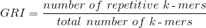
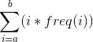
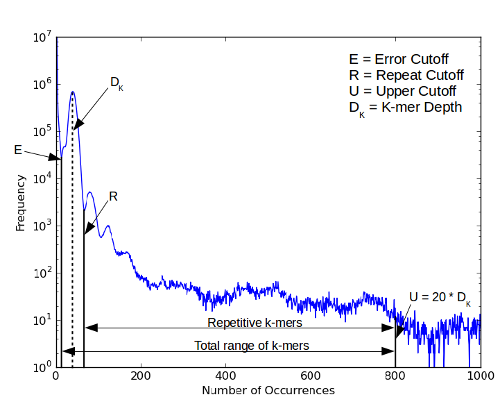

## What is GRIn?

GRIn is a program to make it easy to calculate the Genome Repeat Index (GRI)
for raw sequencing reads. The Genome Repeat Index is the percentage of k-mer
words in a read set which are predicted to be repetitive. We predict that
genomes with a lower GRI will be easier to assemble than those with a higher
one. Hence:



The number of k-mers in a set of reads occurring a minimum of `a` times and a
maximum of `b` times can be computed by:



where `freq(i)` gives the number of distinct k-mers occurring `i` times in the
set of reads.

Additional parameters are required for GRIn to be able to calculate a useful
GRI for real data. See the 'Using GRIn' section of this document.

## Installation

##### Dependencies

GRIn is compatible with both Python 2 and Python 3. It requires Numpy and
Scipy. It has been tested with Numpy 1.9.2 and Scipy 0.16.0. The feature of
Scipy used was introduced in Scipy 0.11.0, and I think the featues of Numpy I
use are so basic that they will always have been present. Therefore I would
guess that GRIn will work on any version of Numpy, and on versions of Scipy >=
0.11.0. If not, please let me know (gh10@sanger.ac.uk).

##### Installing GRIn itself

Download and decompress the latest release (can be found at
https://github.com/george-hall/GRIn/releases/latest).

Inside the decompressed directory will be several files, including `grin.py`.
GRIn can now be run with either `python grin.py` or you can run `chmod +x
grin.py` and then execute it as `./grin.py`

## Using GRIn

First, it is important to note that GRIn requires extra cutoffs to be set in
order to work properly on real data. There are three cutoffs: the Error Cutoff;
the Repeat Cutoff; and the Upper Cutoff. In fact, these cutoffs are so
important that if they are not set by the user then GRIn will estimate them
itself and use those estimations in its calculation of the GRI. 

#### Setting the cutoffs yourself

For each cutoff, you can specify a single cutoff to be used for all input
files, or you can specify individual cutoffs for each file. Single cutoffs
(i.e. those to be applied to all files) are set using flags with capital
letters, whereas individual cutoffs (i.e. those with a specific value set for
each file) are set using flags with lowercase letters.

##### The Error Cutoff

Use `-E / --single-error-cutoff` to specify one error cutoff to be applied to all files.

Use `-e / --indiv-error-cutoffs` to specify one error cutoff per input file.

##### The Repeat Cutoff

Use `-C / --single-repeat-cutoff` to specify one repeat cutoff to be applied to all files.

Use `-c / --indiv-repeat-cutoffs` to specify one repeat cutoff per input file.

##### The Upper Cutoff

Use `-U / --single-upper-cutoff` to specify one upper cutoff to be applied to all files.

Use `-u / --indiv-upper-cutoffs` to specify one upper cutoff per input file.

##### NOTE

The user must not use both the single and individual flags for the same cutoff.

#### Examples

In the following examples, I am using GRIn with two input files (`file1.hist`
and `file2.hist`) in order to demonstrate the different ways in which the user
can enter cutoffs. It should be noted that GRIn can work with any number of
input files.

Using the individual flags for each cutoff:

```
grin -e 4 9 -c 36 49 -u 400 500 -f file1.hist file2.hist
```

Using the single cutoff flag for each:

```
grin -E 5 -C 51 -U 740 -f file1.hist file2.hist
```

Note: The above command is equivalent to:

```
grin -e 5 5 -c 51 51 -u 740 740 -f file1.hist file2.hist
```

Finally, running GRIn without any manual cutoffs set (i.e. they will all be set
automatically):

```
grin -f file1.hist file2.hist
```

Note that you can mix and match different cutoff types. Here, for example, the
Error Cutoff is specified using a single cutoff to be applied to all files, the
Repeat Cutoff is specified using an individual cutoff for each file, and the
Upper Cutoff is not specified at all, and therefore will be automatically
computed by GRIn:

```
grin -E 10 -c 36 72 -f file1.hist file2.hist
```

#### How to use Jellyfish to generate k-mer spectra

This information is correct for Jellyish version 2.2.3 [1], and describes the
most straightforward way of using this program to generate k-mer spectra.
Having installed Jellyfish, run

```
jellyfish count -t **NUMBER OF THREADS** -C -s **SIZE OF HASH TABLE** -m **K-MER SIZE** **INPUT FILES**
```

Where 'SIZE OF HASH TABLE' is the number of cells in a hash table (I normally
use 100 million). This command will store the hash table as a file named
`mer\_counts.jf`. To generate the k-mer spectrum, run

```
jellyfish histo mer_counts.jf > **WHERE TO STORE SPECTRUM**
```

Now you can view the spectrum using an graph plotting tool. For much more
detailed information on how to use Jellyfish to its full extent, see its
documentation.

## The Cutoffs Explained

##### The Error Cutoff

The Error Cutoff is used to exclude erroneous k-mers from being used in the
calculation. These are the k-mers contained in the initial error peak of the
spectrum (i.e. those only occurring fewer than, say, 10 times across all
reads). These k-mers are, with high probability, due to sequencing errors, as
they occur too few times to have originated from a genuine genomic region given
the sequencing depth. 

By default, this cutoff is set to be the number of
occurrences corresponding to the minimum between the error curve and the main
peak in the k-mer spectrum.

##### The Repeat Cutoff

The Repeat Cutoff is our estimation of the minimum number of times we must
observe a k-mer in the set of reads for us to consider it repetitive. In a
k-mer spectrum with easily observed peaks, this is simply the minimum between
the first and second peak. If the peaks are not so easily observed, we set this
to be the value `R` such that the k-mer depth is equidistant between the error
cutoff and `R`.

If unset, GRIn sets the Repeat Cutoff to this value.

##### The Upper Cutoff

We use the upper cutoff to exclude k-mers which are probably due to PCR
duplication or other sequencing biases. 

If unset, GRIn sets this to 20 * k-mer depth. 

##### Diagram with cutoffs labelled



## Notes

We recommend using a k-mer size of 31bp for this tool to work well, although
providing that the k-mers are 'long enough' (roughly between 21bp and 71bp) we
see little difference in the resulting GRI when using different k-mer sizes. We
use Jellyfish [1] for the k-mer counting.

We are currently writing a paper on the GRI and its uses.

## Licensing

GRIn is copyright Genome Research Limited 2016. It is licensed under the GNU
GPL, which is contained in [COPYING](COPYING).

## Contact me

For anything to do with GRIn, contact George Hall at gh10@sanger.ac.uk

## References

[1] https://github.com/gmarcais/Jellyfish
